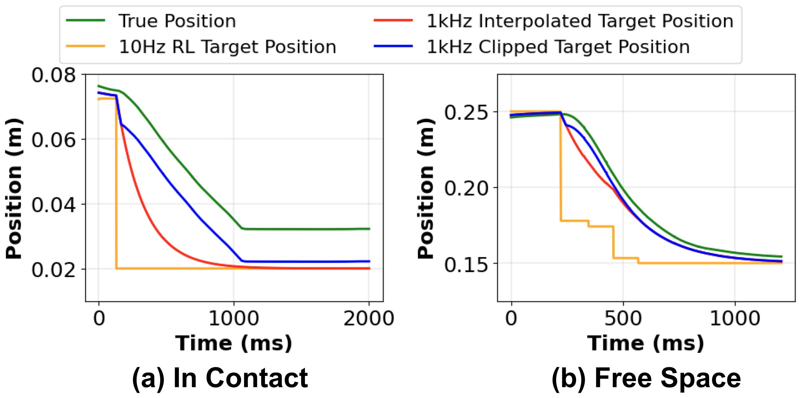

# SERL Franka Controllers

> Robot controller used in SERL (A Software Suite for Sample-Efficient Robotic Reinforcement Learning)

Serl Website and Paper: https://serl-robot.github.io/

`serl_franka_controllers` is a ROS package designed to control Franka Emika Robot through `libfranka` and `franka_ros`. This package provides a compliant yet accurate Cartesian Impedance Controller for safe online reinforcement learning algorithms, as well as a Joint Position Controller for resetting arm. 

Compliance and accuracy is achieved at the same time by limiting the reference point of the Impedance controller to be within a certain distance from the current pose in the realtime loop. This way, a high gain can be used for accuracy without excess force when in contact.




## Installation

### Prerequisites
- ROS Noetic
- Installation of `libfranka>=0.8.0` and `franka_ros>=0.8.0` according to the [Franka FCI Documentation](https://frankaemika.github.io/docs/installation_linux.html)
  ```bash
  sudo apt install ros-noetic-libfranka ros-noetic-franka-ros
  ```

### Installing via apt-get
```bash
sudo apt-get install ros-serl_franka_controllers
```

### Installing from Source
```bash
cd ~/catkin_ws/src
git clone git@github.com:rail-berkeley/serl_franka_controllers.git
cd ~/catkin_ws
catkin_make --pkg serl_franka_controllers
source ~/catkin_ws/devel/setup.bash
```

### Realtime Constraint
The `franka_ros` requires a realtime kernel by default. This is not possible if you want to install CUDA on the same machine. A workaround is to ignore the realtime constraint in `catkin_ws/src/franka_ros/franka_control/config/franka_control_node.yaml`
```yaml
realtime_config: ignore
```


## Usage

### Cartesian Impedance Controller

To launch the Cartesian Impedance Controller, use:
```bash
roslaunch serl_franka_controllers impedance.launch robot_ip:=<RobotIP> load_gripper:=<true/false>
```
Replace <RobotIP> with the IP address of your Franka robot. The load_gripper argument is a boolean value (true or false) depending on whether you have a gripper attached.

Compliance parameters for the controller can be adjusted in an interactive GUI by running `rosrun rqt_reconfigure rqt_reconfigure`. This can also be achieved in Python code as demonstrated in the example section.

### Joint Position Controller

For resetting or moving the robot to a specific joint position, launch the joint position controller:

```bash
rosparam set /target_joint_positions '[q1, q2, q3, q4, q5, q6, q7]'
roslaunch serl_franka_controllers joint.launch robot_ip:=<RobotIP> load_gripper:=<true/false>
```
Here, you also need to replace <RobotIP> with the actual IP address and specify the load_gripper option. Then replace `[q1, q2, q3, q4, q5, q6, q7]` with the desired joint positions.


## rospy Example

We include a `requirements.txt` and python script to show one way of interacting with the controller. This script shows how to adjust the reference limiting values and how to send robot commands through ROS Topics and `dynamic_reconfigure`. To use this, run
```bash
conda create -n serl_controller python=3.8
conda activate serl_controller
pip install -r requirements.txt
python test/test.py --robot_ip=ROBOT_IP
```
